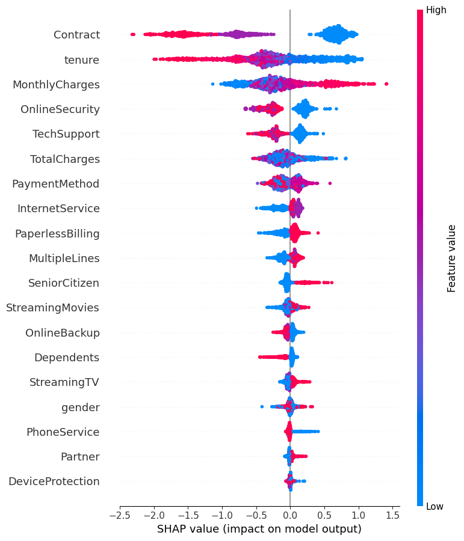

# 🔄 Customer Churn Prediction

An end-to-end Machine Learning project to predict customer churn using XGBoost, with SHAP explainability, MLflow tracking, and FastAPI deployment.

---

## 📊 Project Overview

Telecom companies lose revenue when customers leave. This project predicts which customers are likely to churn, enabling proactive retention strategies.

**Dataset:** [Telco Customer Churn - Kaggle](https://www.kaggle.com/datasets/blastchar/telco-customer-churn)  
**Records:** 7,043 customers | 21 features

---

## 🎯 Results

| Metric | Score |
|--------|-------|
| ROC AUC | 0.8256 |
| Accuracy | 79% |
| Precision (Churn) | 0.63 |
| Recall (Churn) | 0.51 |

---

## 🏗️ Project Structure

```
churn_prediction/
├── src/
│   ├── preprocess.py      # Data cleaning & encoding
│   ├── train.py           # Model training + MLflow
│   ├── evaluate.py        # SHAP explainability
│   ├── predict.py         # Prediction logic
│   └── test_predict.py    # Quick test script
├── api/
│   └── app.py             # FastAPI REST API
├── reports/
│   └── figures/
│       └── shap_summary.png
├── requirements.txt
└── README.md
```

## ⚙️ Tech Stack

- **ML Model:** XGBoost
- **Explainability:** SHAP
- **Experiment Tracking:** MLflow
- **API:** FastAPI + Uvicorn
- **Data Processing:** Pandas, Scikit-learn

---

## 🚀 Quick Start

### 1. Clone the repo
```bash
git clone https://github.com/Albisaifudeen/customer-churn-prediction.git
cd customer-churn-prediction
```

### 2. Create virtual environment
```bash
python -m venv churn_env
churn_env\Scripts\activate
```

### 3. Install dependencies
```bash
pip install -r requirements.txt
```

### 4. Add dataset
Download from Kaggle and place at:
data/raw/WA_Fn-UseC_-Telco-Customer-Churn.csv

### 5. Train model
```bash
cd src
python train.py
```

### 6. Run API
```bash
cd ../api
uvicorn app:app --reload
```

Open → http://127.0.0.1:8000/docs

---

## 📡 API Usage

**POST /predict**

```json
{
  "gender": "Male",
  "SeniorCitizen": 1,
  "Partner": "No",
  "Dependents": "No",
  "tenure": 1,
  "PhoneService": "Yes",
  "MultipleLines": "No",
  "InternetService": "Fiber optic",
  "OnlineSecurity": "No",
  "OnlineBackup": "No",
  "DeviceProtection": "No",
  "TechSupport": "No",
  "StreamingTV": "No",
  "StreamingMovies": "No",
  "Contract": "Month-to-month",
  "PaperlessBilling": "Yes",
  "PaymentMethod": "Electronic check",
  "MonthlyCharges": 95.0,
  "TotalCharges": 95.0
}
```

**Response:**
```json
{
  "churn_probability": 0.7823,
  "will_churn": true,
  "verdict": "⚠️ Customer WILL CHURN"
}
```

---

## 📈 SHAP Explainability



---

## 📝 MLflow Tracking

```bash
mlflow ui --backend-store-uri sqlite:///mlflow.db
```
Open → http://127.0.0.1:5000

---

## 👤 Author

**Albi Saifudeen**  
GitHub: [@Albisaifudeen](https://github.com/Albisaifudeen)
